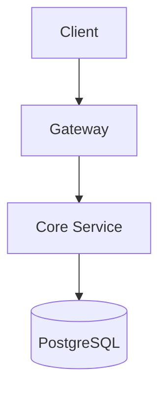

# Diagrams — Technical Documentation

## Tại sao cần diagrams?

- Architecture overview cho developer mới (onboarding)
- Business flows cho stakeholder review
- ERD cho database design
- Sequence diagram cho API integration

**Không có diagrams → mọi kiến trúc chỉ tồn tại trong đầu developer.**

## Cấu trúc folder

```
documents/06-diagrams/
├── README.md               # Index: danh sách diagrams + mục đích
├── source/                  # Source files (.puml, .mmd, .drawio)
├── rendered/                # Output files (.png, .svg) — committed
└── tools/                   # Render tools (plantuml.jar, scripts)
```

**Rule:** Commit CẢ source + rendered. Người đọc không cần install tool để xem diagram.

## Tool Options

| Tool | Format | Ưu điểm | Nhược điểm |
|------|--------|---------|------------|
| **PlantUML** | `.puml` | Text-based, git-friendly, nhiều diagram types | Cần Java runtime |
| **Mermaid** | `.mmd` | Native trong GitHub/GitLab markdown | Ít diagram types hơn PlantUML |
| **Draw.io** | `.drawio` | Visual editor, export PNG/SVG | Binary file, khó diff |

**Recommend:** PlantUML cho projects có Java. Mermaid cho projects nhẹ.

## PlantUML Setup

### Install

```bash
# Option 1: Download jar (cần Java 8+)
mkdir -p documents/06-diagrams/tools
curl -L -o documents/06-diagrams/tools/plantuml.jar \
  "https://github.com/plantuml/plantuml/releases/latest/download/plantuml.jar"

# Option 2: VS Code extension (preview only, không render file)
# Extension: jebbs.plantuml
```

### Render

```bash
# Dùng script (recommend)
scripts/render-diagrams.sh

# Hoặc manual
java -jar documents/06-diagrams/tools/plantuml.jar \
  -tpng -o "$(pwd)/documents/06-diagrams/rendered" \
  documents/06-diagrams/source/*.puml
```

### Syntax Gotchas

| Vấn đề | Ví dụ | Fix |
|--------|-------|-----|
| `()` trong activity label | `:Call method();` | Bỏ `()`: `:Call method;` |
| `{}` trong label | `:Return {};` | Bỏ `{}`: `:Return object;` |
| `/` trong label | `:true/false;` | Dùng text: `:true or false;` |
| File quá dài | >200 lines | Chia thành sub-diagrams |

## Mermaid Setup (alternative)

Không cần install — render trực tiếp trong GitHub markdown:

````markdown

````

Nếu cần render PNG:

```bash
# Install mermaid CLI
npm install -g @mermaid-js/mermaid-cli

# Render
mmdc -i documents/06-diagrams/source/architecture.mmd \
     -o documents/06-diagrams/rendered/architecture.png
```

## Diagrams nên có (minimum)

| Diagram | Mục đích | Khi nào tạo |
|---------|----------|------------|
| Architecture overview | Hệ thống tổng quan | Bắt đầu dự án |
| ERD (database schema) | Quan hệ giữa entities | Sau khi thiết kế DB |
| Business flow | Luồng nghiệp vụ chính | Mỗi domain có flow phức tạp |
| Deployment | Infra topology | Khi setup production |
| Sequence (API) | Tương tác giữa services | Cho cross-service flows |

## Workflow

1. Tạo source file trong `documents/06-diagrams/source/`
2. Render: `scripts/render-diagrams.sh`
3. Commit CẢ source + rendered: `git add documents/06-diagrams/`
4. Update `documents/06-diagrams/README.md` index
